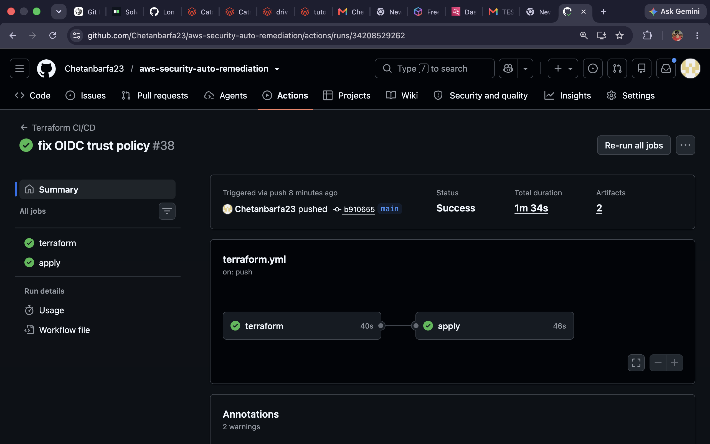
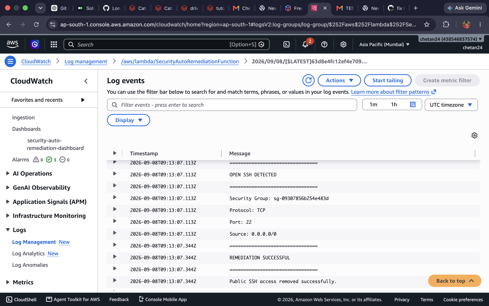
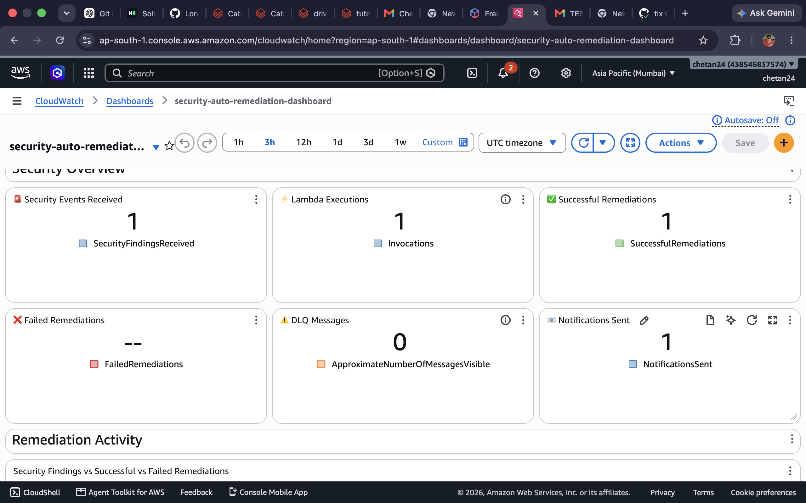
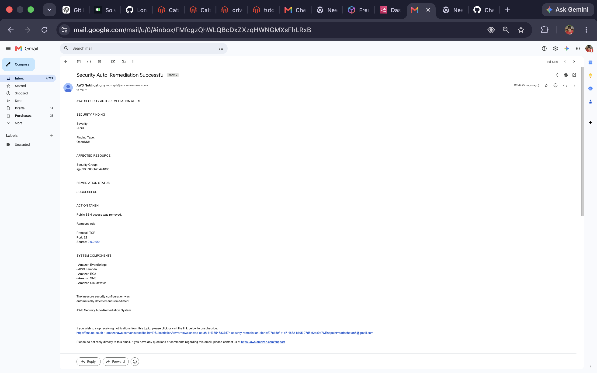

# AWS Security Auto Remediation System

An automated cloud security remediation system built using AWS services, Terraform, Python, and GitHub Actions.

This project automatically detects insecure AWS security configurations, remediates the issue, sends notifications, and provides monitoring through CloudWatch.

---

## 🚀 Project Overview

The AWS Security Auto Remediation System automatically detects security findings and performs remediation actions without manual intervention.

The system demonstrates how cloud security automation can be implemented using Infrastructure as Code (IaC), serverless computing, event-driven architecture, and CI/CD.

### Example Security Scenario

The system detects a security group that allows public SSH access:

```text
Protocol: TCP
Port: 22
Source: 0.0.0.0/0
```

After detection, the system automatically removes the insecure SSH rule.

---

# 🏗️ Architecture

```text
Security Finding
       │
       ▼
Amazon EventBridge
       │
       ▼
AWS Lambda
       │
       ▼
Automatic Security Remediation
       │
       ├──────────────► CloudWatch Logs
       │
       ├──────────────► CloudWatch Metrics
       │
       └──────────────► Amazon SNS
                              │
                              ▼
                       Email Notification
```

---

# 🔐 Security Remediation Flow

1. An insecure AWS security configuration is detected.
2. A security event is generated.
3. Amazon EventBridge receives the event.
4. EventBridge triggers the AWS Lambda function.
5. The Lambda function analyzes the security finding.
6. The insecure security group rule is removed automatically.
7. Logs and metrics are sent to Amazon CloudWatch.
8. A notification is sent using Amazon SNS.
9. The user receives a successful remediation email.

---

# ☁️ AWS Services Used

| AWS Service | Purpose |
|---|---|
| Amazon GuardDuty | Security threat detection |
| Amazon EventBridge | Event-driven automation |
| AWS Lambda | Automated remediation logic |
| Amazon SNS | Email notifications |
| Amazon CloudWatch | Monitoring, logs, metrics, and dashboard |
| Amazon S3 | Terraform remote state storage |
| Amazon DynamoDB | Terraform state locking |
| AWS IAM | Roles and permissions |
| AWS STS | GitHub Actions OIDC authentication |

---

# 🛠️ Technologies Used

- AWS
- Terraform
- Python
- GitHub Actions
- GitHub OIDC
- AWS Lambda
- CloudWatch
- EventBridge
- SNS
- S3
- DynamoDB
- IAM

---

# 📂 Project Structure

```text
aws-security-auto-remediation/
│
├── .github/
│   └── workflows/
│       └── terraform.yml
│
├── lambda/
│   └── handler.py
│
├── terraform/
│   ├── backend.tf
│   ├── cloudwatch.tf
│   ├── dashboard.tf
│   ├── eventbridge.tf
│   ├── guardduty.tf
│   ├── iam.tf
│   ├── lambda.tf
│   ├── outputs.tf
│   ├── provider.tf
│   ├── variables.tf
│   │
│   └── screenshots/
│       ├── github-actions-success.png
│       ├── lambda-remediation-success.png
│       ├── cloudwatch-dashboard.png
│       └── email-notification-success.png
│
└── README.md
```

---

# 🔄 CI/CD Pipeline

The project uses GitHub Actions for automated Terraform deployment.

## Terraform Job

The CI pipeline performs:

1. Checkout repository
2. Install Terraform
3. Authenticate with AWS using GitHub OIDC
4. Build Lambda deployment package
5. Terraform initialization
6. Terraform format validation
7. Terraform validation
8. Terraform plan
9. Upload Terraform plan artifact
10. Upload Lambda package artifact

## Apply Job

The CD pipeline performs:

1. Download Terraform plan
2. Download Lambda package
3. Authenticate with AWS using OIDC
4. Initialize Terraform
5. Verify deployment artifacts
6. Apply Terraform infrastructure

The Terraform Apply job only runs when changes are pushed to the `main` branch.

---

# 🔑 GitHub Actions OIDC Authentication

GitHub Actions authenticates with AWS using OpenID Connect (OIDC).

This removes the need to store long-term AWS access keys inside GitHub Secrets.

```text
GitHub Actions
       │
       ▼
GitHub OIDC Token
       │
       ▼
AWS IAM Role
       │
       ▼
AWS STS
       │
       ▼
Temporary AWS Credentials
```

---

# 📊 Project Screenshots

## GitHub Actions CI/CD Pipeline

Successful Terraform CI/CD pipeline execution.



---

## Automated Lambda Remediation

Lambda function successfully detects and remediates the insecure security configuration.



---

## CloudWatch Security Dashboard

CloudWatch dashboard showing security events, Lambda executions, successful remediations, failed remediations, DLQ messages, and notifications.



---

## Email Notification

Amazon SNS sends an email notification after successful remediation.



---

# 📈 CloudWatch Monitoring

The CloudWatch dashboard monitors:

- Security Events Received
- Lambda Executions
- Successful Remediations
- Failed Remediations
- Dead Letter Queue Messages
- Notifications Sent

---

# 🚀 Deployment

## Clone Repository

```bash
git clone https://github.com/Chetanbarfa23/aws-security-auto-remediation.git
```

Move into the project:

```bash
cd aws-security-auto-remediation
```

---

## Initialize Terraform

```bash
cd terraform
terraform init
```

---

## Validate Terraform

```bash
terraform validate
```

---

## Create Terraform Plan

```bash
terraform plan
```

---

## Deploy Infrastructure

```bash
terraform apply
```

Type:

```text
yes
```

when Terraform asks for confirmation.

---

# 🧪 Testing

To test the automated remediation system:

1. Create or modify a security group with an insecure rule.
2. Allow public SSH access:

```text
Protocol: TCP
Port: 22
Source: 0.0.0.0/0
```

3. Trigger the security detection workflow.
4. Verify that EventBridge receives the security event.
5. Verify Lambda execution.
6. Check CloudWatch logs.
7. Confirm that the insecure rule is removed.
8. Check the CloudWatch dashboard.
9. Verify that an email notification is received.

---

# 🛡️ Security Best Practices Demonstrated

- Automated security remediation
- Event-driven architecture
- Infrastructure as Code
- IAM least privilege access
- GitHub OIDC authentication
- No long-term AWS credentials in GitHub Actions
- CloudWatch monitoring
- Automated notifications
- Terraform remote state management

---

# 🎯 Key Features

- 🔐 Automated security detection
- ⚡ Automatic remediation
- ☁️ Serverless architecture
- 📊 Real-time CloudWatch monitoring
- 📧 Email notifications
- 🚀 Automated CI/CD pipeline
- 🔑 Secure GitHub OIDC authentication
- 🏗️ Infrastructure as Code using Terraform

---

# 👨‍💻 Author

**Chetan Barfa**

GitHub: https://github.com/Chetanbarfa23

---

# ⭐ Conclusion

This project demonstrates an automated AWS cloud security remediation system using Terraform and serverless AWS services.

The system detects insecure configurations, automatically remediates them, monitors activity through CloudWatch, and sends notifications to the user.

The infrastructure deployment process is automated using GitHub Actions and secure OIDC authentication.